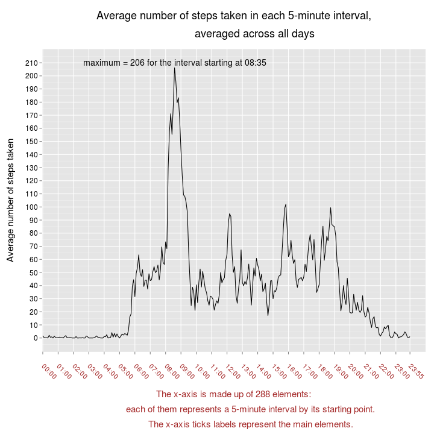
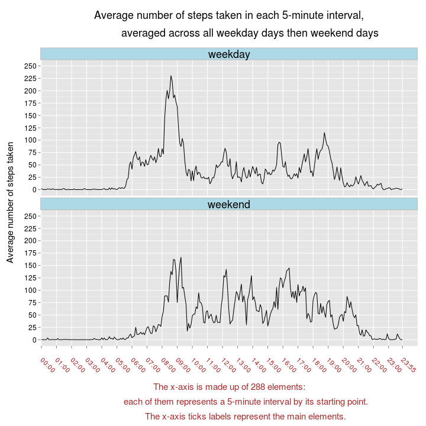

### PA1_template  
### title:"Reproducible Research: Peer Assessment 1"
author: "lelayj"    
date: 2014/12/07    
output:  
 html_document:  
 keep_md: true  
 
 
This study makes use of data from a personal activity monitoring device. This device collects data at 5 minute intervals throughout the day. The data consists of two months of data from an anonymous individual collected during the months of October and November 2012, and include the number of steps taken in 5 minute intervals each day.

#### LOADING AND PREPROCESSING THE DATA   
**LOADING THE DATA**

The activity.zip file comprising the data used here can be found in the same GitHub repository containing the PA1\_template.* files, which include this one.


```r
filename <- "activity"  
destzipfile <-  paste("./", filename, ".zip", sep = "") 
unzip(destzipfile)
destfile <- paste("./", filename, ".csv", sep = "") 
df0 <- read.csv(destfile)
str(df0)
```

```
## 'data.frame':	17568 obs. of  3 variables:
##  $ steps   : int  NA NA NA NA NA NA NA NA NA NA ...
##  $ date    : Factor w/ 61 levels "2012-10-01","2012-10-02",..: 1 1 1 1 1 1 1 1 1 1 ...
##  $ interval: int  0 5 10 15 20 25 30 35 40 45 ...
```

```r
summary(df0)
```

```
##      steps                date          interval     
##  Min.   :  0.00   2012-10-01:  288   Min.   :   0.0  
##  1st Qu.:  0.00   2012-10-02:  288   1st Qu.: 588.8  
##  Median :  0.00   2012-10-03:  288   Median :1177.5  
##  Mean   : 37.38   2012-10-04:  288   Mean   :1177.5  
##  3rd Qu.: 12.00   2012-10-05:  288   3rd Qu.:1766.2  
##  Max.   :806.00   2012-10-06:  288   Max.   :2355.0  
##  NA's   :2304     (Other)   :15840
```


**PROCESSING / TRANSFORMING THE DATA INTO A FORMAT SUITABLE FOR THE ANALYSIS**  

Let's note that:

- the `sort` function removes NAs by default,  
- the sort order for factors is the order of their levels, which in this case are in the desired order.  

Testing exact equality between df0\$date and sort(df0\$date) will ensure that df0\$date both is in the right order and has no NAs (as already shown for the latter by means of `summary`) :  
  


```r
dateSorted <- sort(df0$date)
str(dateSorted)
```

```
##  Factor w/ 61 levels "2012-10-01","2012-10-02",..: 1 1 1 1 1 1 1 1 1 1 ...
```

```r
identical(df0$date, dateSorted)
```

```
## [1] TRUE
```

**So df0\$date has no NAs and is in the right order.**  

- Let's note that the number of 5-minute intervals in a day is equal to 12 x 24 = 288.

Creating the vector allDaysIntervals made up of the 288 5-minute intervals of a day in the right order, the whole repeated 61 times,  then testing exact equality between df0\$interval and this vector to ensure that df0\$interval both is in the right order and has no NAs (as already shown for the latter by means of `summary`) :


```r
oneDayIntervals  <- sort(df0$interval[1:288])

allDaysIntervals <- rep(oneDayIntervals, 61)

identical(df0$interval, allDaysIntervals)
```

```
## [1] TRUE
```

**So df0\$interval has no NAs and is in the right order.**  


Creating a data frame df identical to df0, but with the elements of df\$interval in the form HH:MM


```r
H <- function(t){ floor(t/100) }
M <- function(t){ t - H(t) * 100 }

hour_formatter <- function(t) {
        formattedTime <- sprintf( "%02d:%02d", H(t), M(t) )
        formattedTime
}

df <- df0
df$interval <- hour_formatter(df$interval)
str(df$interval)
```

```
##  chr [1:17568] "00:00" "00:05" "00:10" "00:15" "00:20" ...
```


The following function will be used for some results to be displayed in “fixed point” decimal notation, rounded to 0 decimal places, and not in “exponential” decimal notation:
 


```r
sf <- function(x){sprintf("%.0f", x)}
```

#### WHAT IS MEAN TOTAL NUMBER OF STEPS TAKEN PER DAY  

**MEAN AND MEDIAN:**  

**For the formula method, the function aggregate will ignore the missing values in the given variables:**

```r
dayTotal <- aggregate( steps ~ date, data = df, sum )

str(dayTotal)
```

```
## 'data.frame':	53 obs. of  2 variables:
##  $ date : Factor w/ 61 levels "2012-10-01","2012-10-02",..: 2 3 4 5 6 7 9 10 11 12 ...
##  $ steps: int  126 11352 12116 13294 15420 11015 12811 9900 10304 17382 ...
```

**dayTotal has 53 days instead of the 61 days of October and November. Which means that the days that do not appear in dayTotal are days for each of which all of the corresponding 288 elements of df\$steps are NAs.**

Searching the days that appear in df\$date but not in dayTotal:

```r
omittedDaysLogical <- !(is.element(unique(df$date), dayTotal$date))
omittedDays <- unique(df$date)[omittedDaysLogical]
```

**The days that do not appear in dayTotal are 8 in total and are the following:  2012-10-01, 2012-10-08, 2012-11-01, 2012-11-04, 2012-11-09, 2012-11-10, 2012-11-14, 2012-11-30.**  


```r
mean1 <- mean(dayTotal$steps)
median1 <- median(dayTotal$steps)
```

**The mean and median total number of steps taken per day are 10766 and 10765, respectively.**  

**HISTOGRAM OF THE TOTAL NUMBER OF STEPS TAKEN EACH DAY, ALSO SHOWING THE MEAN AND THE MEDIAN:**

```r
library(ggplot2)

breaks_x <- 1000 * 0:22

lim_y <- 12
breaks_y <- 2 * 0:5

ggplot(dayTotal, aes(x = steps)) +
        
        geom_histogram( breaks = breaks_x, fill="lightpink" , colour="black") +
        
        geom_rug()  +   
        
        scale_x_continuous( breaks = breaks_x ) +
        
        scale_y_continuous( limits = c(0, lim_y), breaks = breaks_y ) +
        
        theme_gray() +
        theme( axis.text.x = element_text( angle =-50, hjust=0, vjust = 1, 
                                           color="darkred", size = 8 ),
               axis.text.y = element_text( color = "darkred", size = 12 ) ,
               axis.title = element_text( size = 18 ) ) +
        
        labs( x = "Number of steps taken in a day",
              y = "Number of days") +
        
        geom_vline( xintercept =  median1 ,
                    linetype = "solid", color = "brown", size = 1 ) +
        
        geom_vline( xintercept =  mean1 ,
                    linetype = "solid", color = "brown", size = 1 ) +
        
        annotate( "text", x = median1, y = Inf,
                  label = paste( "median =", sf( median1 ) ),
                  hjust =  1.1, vjust = 2, color = "brown", size = 5 ) +
        
        annotate( "text", x = mean1, y = Inf,
                  label = paste( "mean =", sf( mean1 ) ),
                  hjust =  -0.07, vjust = 2, color = "brown", size = 5 ) 
```

 


#### WHAT IS THE AVERAGE DAILY ACTIVITY PATTERN  

**INTERVAL CONTAINING THE MAXIMUM NUMBER OF STEPS on average across all the days in the data set:**

```r
ag1 <- aggregate( steps ~ interval, data = df, mean )

maxiMean <- max(ag1$steps)
maxiMeanIndices <- which(ag1$steps == maxiMean)
h <-  ag1$interval[maxiMeanIndices] 
```

**There is only 1 interval that contains the maximum number of steps (206), on average across all the days in the data set, this one starting at 08:35.**    

**TIME SERIES PLOT OF THE AVERAGE NUMBER OF STEPS TAKEN, averaged across all days, versus the 5-minute intervals:**

```r
breaks_x <- ag1$interval[c( 0:23 * 12 + 1, 24 * 12)]

breaks_y <- seq( 0, 210, by = 10)

library(ggplot2)

ggplot(ag1, aes( x = factor(interval), y = steps, group = 1 ) ) +
        
        geom_line() + 
        
        expand_limits( x = length(ag1$interval) + 12 ) +
        
        scale_x_discrete( breaks = breaks_x  )+
        
        scale_y_continuous( breaks = breaks_y ) +
        
        theme_gray() +
        
        theme( axis.text.x = element_text( hjust = 0, vjust = 0.5, angle = -45, 
                                           color = "brown", size = 12 ),
               axis.text.y = element_text( color = "black", size = 12 ),
               axis.title.x = element_text( lineheight = 0.7, color = "brown", size = 15 ),
               axis.title.y = element_text( angle = 90, size = 15 ),
               plot.title = element_text( lineheight = 0.7, size = 18 ) ) + 
        
        labs( title = "Average number of steps taken in each 5-minute interval,\n 
              averaged across all days\n",
              
              x = "\n\nThe x-axis is made up of 288 elements:\n
              each of them represents a 5-minute interval by its starting point.\n
              The x-axis ticks labels represent the main elements.",
              
              y = "Average number of steps taken\n") +
        
        annotate("text", x = h , y = maxiMean + 4,
                 label = paste("maximum =", sf(maxiMean), "for the interval starting at", h) )
```

 

#### IMPUTING MISSING VALUES
**TOTAL NUMBER OF MISSING VALUES IN THE DATA SET:**  
As seen above, **the missing values only lie in df\$steps, so the total number of rows with NAs will be equal to the  number of missing values in df\$steps** ( which is already shown in `summary`).
 

```r
NAStepsIndices <- which(is.na(df$steps))
```

**The total number of rows with NAs is equal to 2304.**

Furthermore, as seen above, **the 8 days that do not appear in dayTotal only contain NAs**. And since the number of 5-minute intervals in a day, 12 x 24 = 288, multiplied by 8 gives 2304, which is the  number of missing values in df\$steps, **the missing values of the data set are those of the 8 days that do not appear in dayTotal.**

**DEVISING A STRATEGY FOR FILLING IN ALL OF THE MISSING VALUES IN THE DATA SET:**  

 Given the above, it is not relevant to fill in a missing value with the mean or median of the day in which the missing value lies, as that day only contains  NAs: the mean and the median would be equal to NaN and NA, respectively, once all the NAs have been removed from the day using mean( x, na.rm = TRUE ) and median(x, na.rm = TRUE).  
So:  
**CREATING A NEW DATA FRAME IDENTICAL TO df WITH THE EXCEPTION THAT EACH NA ELEMENT OF df\$steps IS REPLACED WITH THE AVERAGE NUMBER OF STEPS TAKEN, AVERAGED ACROSS ALL DAYS, OF THE 5-MINUTE INTERVAL IN WHICH THE MISSING VALUE LIES:**


```r
# ensuring that the order of the 288 elements of ag1$interval is the same as that of  df$interval[1:288]
identical(ag1$interval, df$interval[1:288])
```

```
## [1] TRUE
```

```r
# replicating 61 times ag1$steps:
ag1stepsx61 <- rep(ag1$steps,61)

new_df <- df

# (df and dfnew are as yet identical, but we will consider newNAStepsIndices for the sake of clarity)
new_NAStepsIndices <- which(is.na(new_df$steps))

new_df$steps[new_NAStepsIndices] <- ag1stepsx61[new_NAStepsIndices]

str(new_df)
```

```
## 'data.frame':	17568 obs. of  3 variables:
##  $ steps   : num  1.717 0.3396 0.1321 0.1509 0.0755 ...
##  $ date    : Factor w/ 61 levels "2012-10-01","2012-10-02",..: 1 1 1 1 1 1 1 1 1 1 ...
##  $ interval: chr  "00:00" "00:05" "00:10" "00:15" ...
```
 

**The data frame new\_df contains 0 NAs: this data frame is the original data frame df in which each NA element of df\$steps has been replaced with the mean number of steps of the corresponding 5-minute interval.**  


**CALCULATING AND REPORTING THE MEAN AND MEDIAN TOTAL NUMBER OF STEPS TAKEN PER DAY FOR THE NEW DATA SET:**


```r
new_dayTotal <- aggregate( steps ~ date, data = new_df, sum )

mean2 <- mean(new_dayTotal$steps)
median2 <- median(new_dayTotal$steps)
```

**The new mean total number of steps taken per day is 10766 and the new median is 10766 as well.**  

**HISTOGRAM OF THE TOTAL NUMBER OF STEPS TAKEN EACH DAY FOR THE NEW DATA SET, ALSO SHOWING THE MEAN AND THE MEDIAN:**

```r
library(ggplot2)

breaks_x <-  1000 * 0:22

lim_y <- 20
breaks_y <- 2 * 0:9

ggplot(new_dayTotal, aes(x = steps)) +
        
        geom_histogram( breaks = breaks_x, fill="lightpink" , colour="black") +
        
        geom_rug()  +   
        
        scale_x_continuous( breaks = breaks_x ) +
        
        scale_y_continuous( limits = c(0, lim_y), breaks = breaks_y ) +
        
        theme_gray() +
        theme( axis.text.x = element_text( angle =-50, hjust=0, vjust = 1, 
                                           color="darkred", size = 8 ),
               axis.text.y = element_text( color = "darkred", size = 12 ) ,
               axis.title = element_text( size = 18 ) ) +
        
        labs( x = "Number of steps taken in a  day",
              y = "Number of days") +
                
        geom_vline( xintercept =  mean(new_dayTotal$steps) ,
                    linetype = "solid", color = "brown", size = 1 ) +
        
        annotate( "text", x = median2, y = Inf,
                  label = paste( "median =", sf(median2) ),
                  hjust =  1.1, vjust = 2, color = "brown", size = 5 ) +
        
        annotate( "text", x = mean2, y = Inf,
                  label = paste( "mean =", sf(mean2) ),
                  hjust =  -0.07, vjust = 2, color = "brown", size = 5 ) 
```

 

**DO THESE VALUES DIFFER FROM THE ESTIMATES FROM THE FIRST PART?** 


**MEANS**


```r
par(mar=c(0,0,0,0), oma = c(0,0,0,0), cex=1.8)

#l = limite
l <-75

plot( 0:l+1, 0:l+1, axes = FALSE, type="n", xlab = "", ylab = "")


text(1,l, cex = 0.7, adj = 0, "Let  day_1,  day_2, ... ,  day_53   be  the  53  days  without  NAs," )


text(1,l-10, cex = 0.7, adj = 0, expression( s[ik]*" be the number of steps taken during the 5-minute interval i = 1, ... , 288  of  day_k,  k = 1, ... , 53," ) )


text(1,l-20, cex = 0.7, adj = 0, "mean_i be the average number of steps of the 5-minute interval i, averaged across all days,") 


text(1,l-30, cex = 0.7, adj = 0, "and total_k be the total number of steps of the day_k.")


text(1,l-40, cex = 0.7, adj = 0, expression("we have     "*mean2==textstyle( frac(1,61))%*%(8%*%sum(mean_i, i==1, 288)+sum(total_k, k==1, 53))) )


text(1,l-50, cex = 0.7, adj = 0, expression("and since  mean_i =   "*textstyle( frac(1,53) )%*%sum(s[ik], k==1, 53)*"    and    total_k  =  "*sum(s[ik], i==1, 288)*"            we get:") )

text(1,l-60, cex = 0.7, adj = 0, expression(sum(mean_i, i==1, 288)==sum((textstyle( frac(1,53) )%*%sum(s[ik], k==1, 53)), i==1, 288)*"    =   "*textstyle(frac(1,53))%*%sum( sum(s[ik], i==1, 288 ), k==1, 53 )*"  =  "*textstyle( frac(1,53) )%*%sum(total_k, k==1, 53)*"      ( note :  "*sum(mean_i, i==1, 288)*"  =  "* bold(mean1)*" )" ))


text(1,l-70, cex = 0.7, adj = 0,  expression( "so :   "*mean2 == textstyle( frac(1,61))%*%(8%*%textstyle( frac(1,53) )%*%sum(total_k, k==1, 53)+sum(total_k, k==1, 53))*"   =   "*textstyle(frac(1,53))%*%sum( total_k, k==1, 53 )*"      i.e.     "*bold( mean2)*"  =  "*bold(mean1) ) )
```

 

**This shows the exact equality between the new mean and the former one.**

**MEDIANS**

- As we have just seen, the total number of steps in new\_df for each of the 8 days mentioned above, sum of mean\_i (i = 1,..., 288), is  equal to mean1 = 10766 (= mean2). 

- the median of dayTotal\$steps, **median1, is equal to 10765**.  

- it is relevant to search the indices for which a number equal to this median can be found in sort(dayTotal\$steps), because length(dayTotal\$steps) is an odd number (53), and the median is therefore an element of dayTotal\$steps, of index 27 in sort(dayTotal\$steps).  

```r
median1Indices <- which(sort(dayTotal$steps) == median(dayTotal$steps) )
```


- the greatest index for which  a number equal to median1 can be found in sort(dayTotal\$steps) is 27. 

- sort(new\_dayTotal\$steps) could be obtained from sort(dayTotal\$steps) by simply **adding the 8 numbers 10766 in the right places**, and doing so, since 10765 < 10766, the 8 numbers come on the right of 10765 (not necessarily right next to 10765) and **the greatest index of the number 10765 in sort(new\_dayTotal\$steps) remains 27**. 

- length(new\_dayTotal\$steps) is an odd number (61), so **the median of new\_dayTotal\$steps is an element of new\_dayTotal\$steps, of index 31 in sort(new\_dayTotal\$steps)**.  

**Therefore the new median will be greater than the previous one.  
But the new median cannot be greater than 10766 since there is not enough room for the 8 numbers 10766 from the place 28 to the place 30.  
And it turns out that the place 31 is taken by 10766, which means that there are less than 31 - 27 = 4 elements of dayTotal greater than the former median and less than 10766, which becomes the new median.**


**WHAT IS THE IMPACT OF IMPUTING MISSING DATA ON THE ESTIMATES OF THE TOTAL DAILY NUMBER OF STEPS?**

We have just seen above that 8 days contained only NAs in terms of steps, whereas the other 53 days comprised no NAs.  
**Only the 8 days containing  NAs have seen changes: their estimates  did not exist in dayTotal, since these days were removed. Each of them shows now a total daily number of steps equal to mean1 = 10766 (= mean2), whereas the estimates of the other 53 days remain the same.**

#### ARE THERE DIFFERENCES IN ACTIVITY PATTERNS BETWEEN WEEKDAYS AND WEEKENDS?

**CREATING A NEW FACTOR VARIABLE IN THE DATA SET WITH TWO LEVELS – “WEEKDAY” AND “WEEKEND”:**

```r
Sys.setlocale(category="LC_TIME", locale="C")
```

```
## [1] "C"
```

```r
dates <- as.Date(new_df$date) 

days <- weekdays(dates)

convert <- function(day){
        if (identical(day, "Saturday" )| identical(day, "Sunday" )){ "weekend"}
        else                                    { "weekday" }
}

DF <- new_df

DF$dayType <- mapply(convert, days)

DF$dayType <- factor(DF$dayType)

str(DF)
```

```
## 'data.frame':	17568 obs. of  4 variables:
##  $ steps   : num  1.717 0.3396 0.1321 0.1509 0.0755 ...
##  $ date    : Factor w/ 61 levels "2012-10-01","2012-10-02",..: 1 1 1 1 1 1 1 1 1 1 ...
##  $ interval: chr  "00:00" "00:05" "00:10" "00:15" ...
##  $ dayType : Factor w/ 2 levels "weekday","weekend": 1 1 1 1 1 1 1 1 1 1 ...
```

```r
ag2 <- aggregate( steps ~ interval + dayType, data = DF, mean )
```

**MAKING A PANEL PLOT:**

```r
breaks_x <- ag2$interval[c( 0:23 * 12 + 1, 24 * 12)]

breaks_y <- seq( 0, 250, by = 25)

library(ggplot2)
ggplot(ag2, aes( x = factor(interval), y = steps, group = 1 ) ) +
        
        geom_line() + 
                                        
        facet_wrap(~ dayType, ncol = 1) +
        
        expand_limits( x = length(ag2$interval)/2 + 12 ) +
        
        expand_limits( y = 250 ) +
        
        scale_x_discrete( breaks = breaks_x) +
        
        scale_y_continuous( breaks = breaks_y ) +
        
        theme_gray() +
        
        theme( axis.text.x = element_text( hjust = 0, vjust = 0.5, angle = -45, 
                                           color = "brown", size = 12 ),
               axis.text.y = element_text( color = "black", size = 12 ),
               axis.title.x = element_text( lineheight = 0.7, color = "brown", size = 15 ),
               axis.title.y = element_text( angle = 90, size = 15 ),
               plot.title = element_text( lineheight = 0.7, size = 18 ), 
               strip.text = element_text(  size = rel(1.5)),
               strip.background = element_rect(fill = "lightblue", color = "gray", size = 0.5) ) + 
        
        labs( title = "Average number of steps taken in each 5-minute interval,\n 
              averaged across all weekday days then weekend days\n",
              
              x = "\n\nThe x-axis is made up of 288 elements:
              
              each of them represents a 5-minute interval by its starting point.
              
              The x-axis ticks labels represent the main elements.",
              
              y = "Average number of steps taken\n") 
```

 
